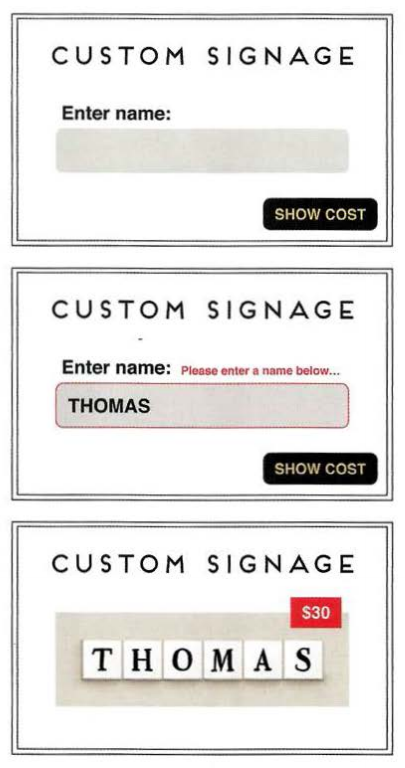
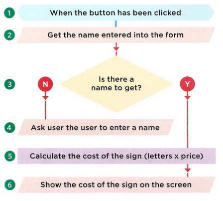
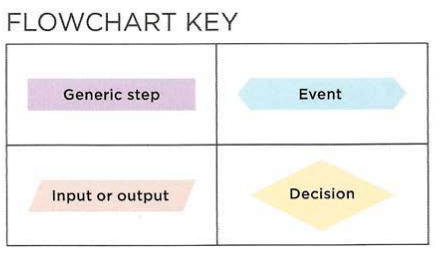
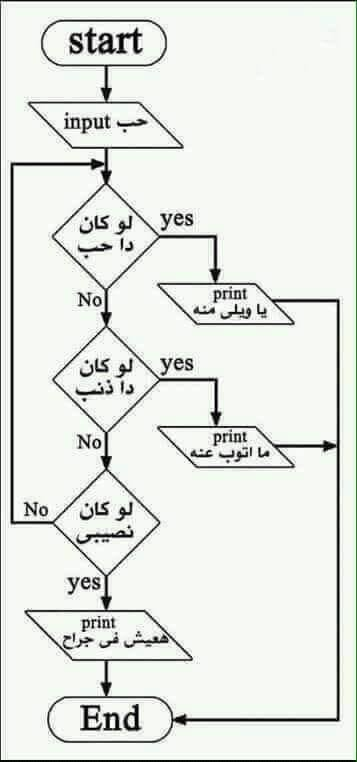

# ABC of programming.

To write a script, you need first to state your goal and then list the tasks that need to be completed in order to achieve it.
Start with the big picture of what you want to achieve, and break that down into small steps.

## Form steps to code

You need to learn to "Think" like a computer because they solve tasks in different ways that you or I might approach them.

### Example: In the following figure we are going to list steps and break down a task.

The task would be a calculation of how much cost to design your name. Considering that each character will cost 5 Euro.

 exercises

**Break down steps**

1. The script is triggered when the button is clicked.
2. It collects the name entered into the form field.
3. It checks that the user has entered a value.
4. If the user has not entered anything, a message will appear telling them to enter a name.
5. If a name has been entered, calculate the cost of the sign by multiplying the number of letters by the cost per letter.
6. Show how much the plaque costs.

**Draw a simple chart in a way you understand**

---

### References and Terms:

> :gem: It is good to know more about flow chart, at least understand how they work and how to draw them in a very simple way. In this [Flow chart tutorial](https://www.youtube.com/watch?v=6F8cTBbh_TI&list=PLMQ4k-hUWGNl-_4tGH-2Gq-06yZbzl5az) list, you can increase your knowledge and learn more about them.

> :bulb: It is good to form Nancy song into a chart

