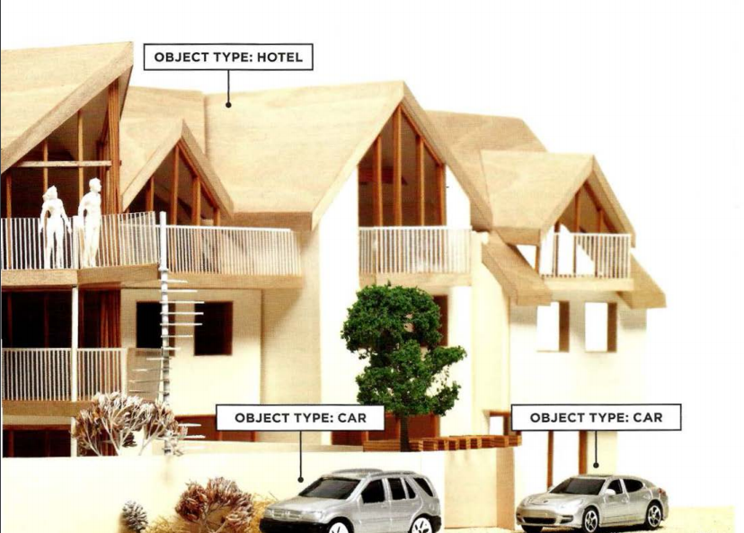
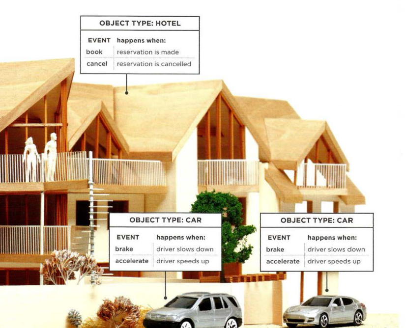
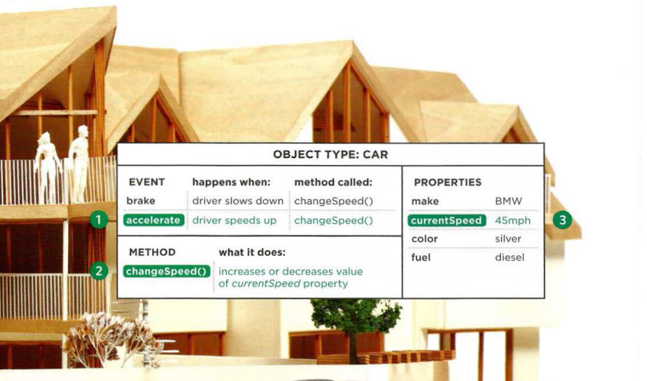
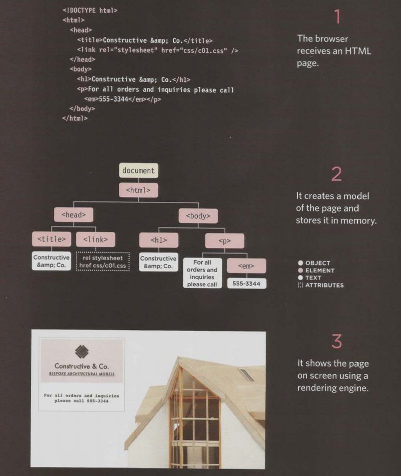

# How computer understand real world.

Here is a model of a hotel, along with some model trees, model people, and model cars. To a human, it is clear what kind of real-world object each one represents.

Computer will understands objects for each element. and each object has specific items type:

- Properties
- Events
- Methods

## Objects

Objects has name and values which can be used to represent our model.

## Events

In the real world, people interact with objects. These interactions can change the values of the properties in these objects.

## Methods

Methods represent things people need to do with objects. They can retrieve or update the values of an object's properties.

## Putting all together

Computers use data to create models of things in the real world. The events, methods, and properties of an object all relate to each other:
Events can trigger methods, and methods can retrieve or update an object's properties.

:bulb: **WEB BROWSERS ARE PROGRAMS BUILT USING OBJECTS** :bulb:

## How the browser sees a web page

---

### References and Terms:

> :gem: It is good to know more about flow chart, at least understand how they work and how to draw them in a very simple way. In this [Flow chart tutorial](https://www.youtube.com/watch?v=6F8cTBbh_TI&list=PLMQ4k-hUWGNl-_4tGH-2Gq-06yZbzl5az) list, you can increase your knowledge and learn more about them.

> :information_source: Read more about [HTML elements](https://en.wikipedia.org/wiki/HTML_element#Elements_vs._tags)
