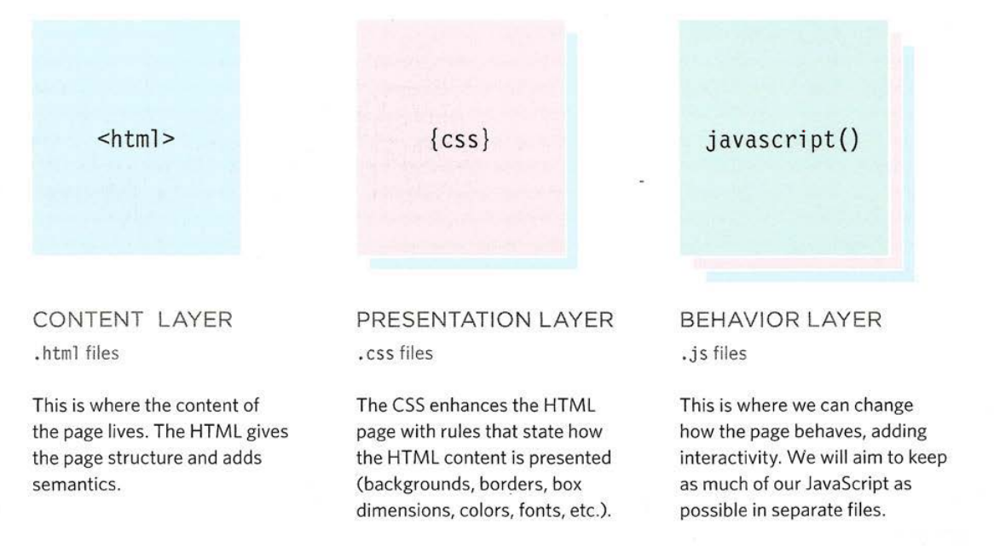

## How do I write script for a web page?

Before diving into the JavaScript language, you need to know how it will fit together with the HTML and CSS in your web pages.

And to do that, dont forget the 3-layers concept



Try to execute the following example:

**index.html** or **greeting.html**

```html
<!DOCTYPE html>
<html lang="en">
  <head>
    <meta charset="UTF-8" />
    <meta name="viewport" content="width=100%, initial-scale=1.0" />
    <meta http-equiv="X-UA-Compatible" content="ie=edge" />
    <title>Greeting</title>
    <link rel="stylesheet" href="style.css" />
  </head>
  <body>
    <div class="container">
      <h1 class="text"></h1>
    </div>
    <script src="script.js"></script>
  </body>
</html>
```

**style.css**

```css
body {
  width: 100vw;
  height: 100vh;
  margin: 0;
  padding: 0;
  background: #272727;
}

.container {
  height: 100%;
  width: 100%;
  display: flex;
  justify-content: center;
  align-items: center;
  color: white;
}

.text {
  background: rgba(255, 255, 255, 0.4);
  margin: 0;
  align-self: center;
  padding: 20px;
  border-radius: 10px;
}
```

**script.js**

```js
let today = new Date();
let text = document.querySelector(".text");
let hour = today.getHours();
let greeting;

if (hour > 18) {
  greeting = "Good evening!";
} else if (hour > 12) {
  greeting = "Good afternoon!";
} else {
  greeting = "Good morning!";
}

text.innerText = greeting;
```

See examples `examples/c01/add-content.html`.

## Linking JavaScript file to the HTML Page

It is better to know where to put your script inside your html file. the best and usual place is to be at the end of the `<body>` element before the closing tag of `</body>`.

```html
[ ... ]
  <body>
    [ ... ]
    <script src="your_script_here.js"></script>
  </body>
</html>
```
