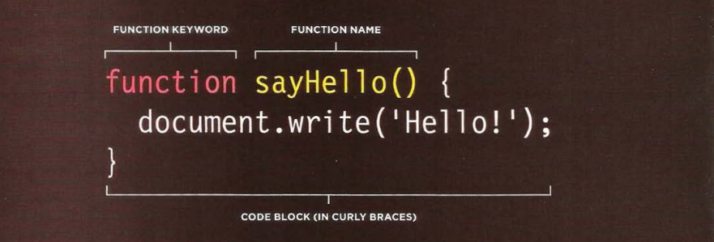
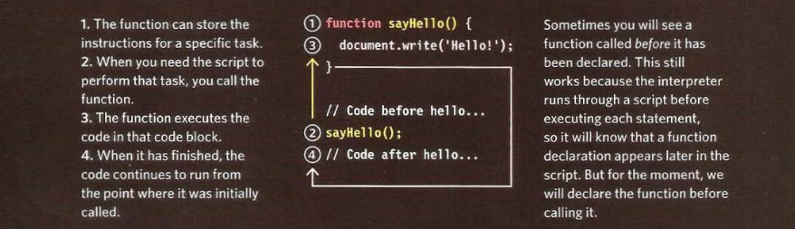
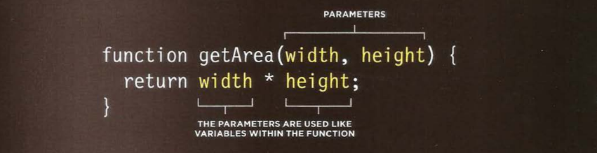

# WHAT IS A FUNCTION?

Functions let you group a series of statements together to perform a specific task. If different parts of a script repeat the same task, you can reuse the function (rather than repeating the same set of statements).

We will explore functions in ES5 since they are presenting a complex idea before `ES6 fat arrow function` come in place.

Let us take simple example:

**index.html**

```html
<!DOCTYPE html>
<html>
  <head>
    <title>Basic Function</title>
    <link rel="stylesheet" href="css/c03.css" />
  </head>
  <body>
    <h1>TravelWorthy</h1>
    <div id="message">Welcome to our site!</div>
    <script src="js/basic-function.js"></script>
  </body>
</html>
```

**style.css**

```css
/* JavaScript & jQuery - Chapter 3: Functions, Methods & Programming */
/* The book used a font called Eau Sans - the download examples use Open Sans */

@import url(http://fonts.googleapis.com/css?family=Open+Sans);

body {
  background-color: #fff;
  background: url("../images/travelworthy-backdrop.jpg") no-repeat center center
    fixed;
  -webkit-background-size: cover;
  -moz-background-size: cover;
  -o-background-size: cover;
  background-size: cover;
  margin: 0px;
  font-family: "Open Sans", sans-serif;
}

h1 {
  background: #1e1b1e url("../images/travelworthy-logo.gif") no-repeat;
  width: 230px;
  height: 180px;
  float: left;
  text-indent: 100%;
  white-space: nowrap;
  overflow: hidden;
  margin: 0px;
}

/* message under the logo */

#message {
  float: left;
  clear: left;
  background-color: #ffb87a;
  color: #1e1b1e;
  width: 170px;
  padding: 18px 30px;
  text-align: center;
}
```

**script.js** in **ES5**

```js
// Create a variable called msg to hold a new message
var msg = "Sign up to receive our newsletter for 10% off!";

// Create a function to update the content of the element whose id attribute has a value of message
function updateMessage() {
  var el = document.getElementById("message");
  el.textContent = msg;
}

// Call the function
updateMessage();
```

**script.js** in **ES6**

```js
// Create a variable called msg to hold a new message
let msg = "Sign up to receive our newsletter for 10% off!";

// Create a function to update the content of the element whose id attribute has a value of message
let updateMessage = () => {
  let el = document.getElementById("message");
  el.textContent = msg;
};

// Call the function
updateMessage();
```

## Function declaration

To declare a function, you give it a name and then write the statements needed to achieve its task inside the curly braces. this known as `function declaration`.

**Rule(ES5): function _manditory_name_ (_Optional_variables_) { //your code }**



## Calling a function

After declaring a function, you can then execute all of statements between its curly braces with just one line of code.
This is known as `calling a function`.


## Function flow



## Declaring a function that need information

Sometimes a function needs specific information to perform its task. In such cases, when you declare the function you give it `parameters` inside the function, the parameters act like variables.



## Calling a function that need information

When you call a function that has parameters, you specify the value it should use in the parentheses that follow its name. The value are called arguments, and they can be provided as values or variables.

### 1. Arguments as values

```js
getArea(3, 5);
```

### 2. Arguments as variables

```js
var wallWidth = 3;
var wallHeight = 3;
getArea(wallWidth, wallHeight);
```

## Getting a single value out of a function

Some functions returns information to the code that called them. For example, when they perform a calculation, they return the result.

```js
function calculateArea(width, height) {
  var area = width * height;
  return area;
}

var wallOne = calculateArea(3, 4);
var wallTwo = calculateArea(8, 5);
```

## Getting a multiple values out of a function

Functions can return more than one value using an array.
For example, this function calculate the area and volume of a box.

```js
function getSize(width, height, depth) {
  var size = width * height;
  var volume = width * height * depth;
  var size = [size, volume];
  return size;
}
var areaOne = getSize(3, 2, 3)[0];
var volumeOne = getSize(3, 2, 3)[0];
```

## Anonymous functions & function expressions

`Expressions produce a value`. They can be used where values are expected. If a function is placed where a browser expects to see an expression, then it gets treated as an expression.

### 1. Function declaration

A fun ction declaration creates a function that you can call later in your code.

```js
function area(width, height) {
  return width * height;
}
var size = area(3, 4);
```

### 2. Function expression

If you put a function where the interpreter would expect to see an expression, then it is treated as an expression, and it is known as a **`function expression`**.

```js
var area = function(width, height) {
  return width * height;
};
var size = area(3, 4);
```
