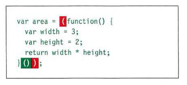

# IMMEDIATELY INVOKED FUNCTION EXPRESSIONS

This way of writing a function is used in several different situations. Often functions are used to ensure that the variable names do not conflict with each other (especially if the page uses more than one script).

```js
var area = (function() {
  var width = 3;
  var height = 3;
  return width * height;
})();
```



## When tou use IIFE?

1. It is used to prevent conflicts between two scripts that might use the same variable names.
2. To make auto execute for a function and calculate a value for another variable. Like execute specific configuration for your system.

## Variable scope

The location where you declare a variable will affect where it can be used within your code. If you declare it within a function, it can only be used within that function. This is known as the variable's scope.

We have 2 scopes which are:

### 1. Local scope:

Any variable declaration **`inside`** a function will be considered as local variables.

### 1. Global scope:

Any variable declaration **`outside`** a function will be considered as local variables.


## How memory & variable works?

`Global variables` use more memory. The browser has to remember them for as long as the web page using them. `Local variables` are only remembered during the period of time that a function is being executed. It is good to note that any local variable inside a function will be lost when the function ends.
