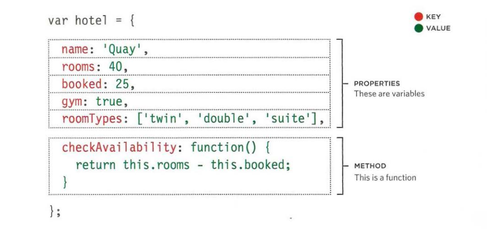
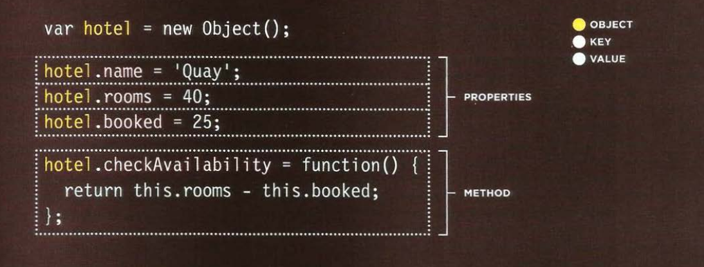
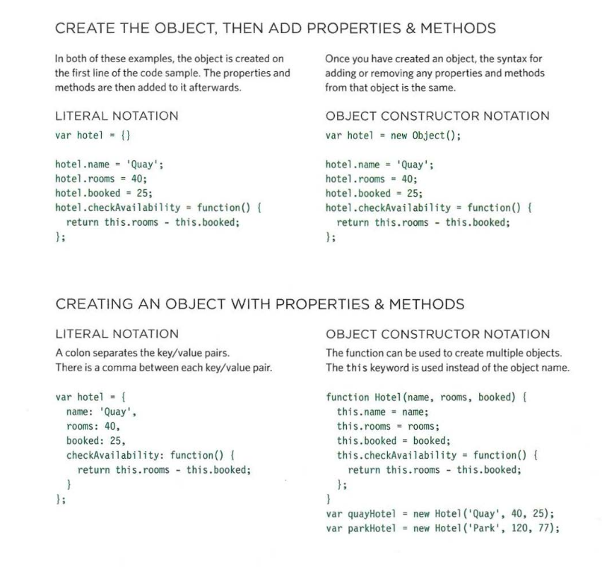

# What is Objects

Objects group together a set of variables and functions to create a model of a something you would recognize from the real world. In an object, variables and functions take on new names.

- In objects, variable become as `properties`.
- In objects, functions become as `methods`.


This object represents a hotel. It has five properties and one method. The object is in curly braces. It is stored in a variable called `hotel`.

```js
let hotel = {
  // Properties
  name: `Quay`,
  rooms: 40,
  booked: 25,
  gym: true,
  roomType: ["twin", "double", "suite"],

  // Method
  checkAvailability: () => {
    return this.rooms - this.booked;
  }
};
```



From what we see of `hotel` object:

| Key               | Value type |
| ----------------- | ---------- |
| name              | string     |
| rooms             | number     |
| booked            | number     |
| gym               | boolean    |
| roomTypes         | array      |
| checkAvailability | Function   |

Objects in JavaScript are aggregation of `primitive types` and other object also.

## Create an object using (Literal notation)

Literal notation is the easiest and most popular way to create objects.

- The object is the curly braces and their contents.
- The object is stored in a variable called `ANY_VALID_VARIABLE_NAME`.
- Separate each key from its value using a colon.
- Separate each property and method by a `comma` BUT not after the last value.

```js
let myName = {
  firstName: "Ahmed",
  lastName: "HAMEED",
  ageAsString: "I will not tell you",
  lovableProgrammingLanguage: "JavaScript",
  isHeCrazyGeek: false
};
```

## Accessing an object

You can access the properties or methods of an object by using `dot` notation. Also you can access properties by using square brackets.

```js
// ES5
var fullName = myName.firstName + " " + myName.lastName; // Ahmed HAMEED
// ES6
let fullName = `${myName.firstName} ${myName.lastName}`; // Ahmed HAMEED
```

OR accessing by square brackets

```js
// ES5
var fullName = myName["firstName"] + " " + myName["lastName"]; // Ahmed HAMEED
// ES6
let fullName = `${myName["firstName"]} ${myName["lastName"]}`; // Ahmed HAMEED
```

example found in **Examples/c3/js/object-literal.js**

**HTML**

```html
<!DOCTYPE html>
<html>
  <head>
    <title>
      JavaScript &amp; jQuery - Chapter 3: Functions, Methods &amp; Objects -
      Object Literal
    </title>
    <link rel="stylesheet" href="css/c03.css" />
  </head>
  <body>
    <h1>TravelWorthy</h1>
    <div id="info">
      <h2>hotel availability</h2>
      <div id="hotelName"></div>
      <div id="availability">
        <p id="rooms"></p>
        <p>rooms left</p>
      </div>
    </div>
    <script src="js/object-literal.js"></script>
  </body>
</html>
```

**JavaScript**

```js
// Set up the object
var hotel = {
  name: "Quay",
  rooms: 40,
  booked: 25,
  checkAvailability: function() {
    return this.rooms - this.booked; // Need "this" because inside function
  }
};

// Update the HTML
var elName = document.getElementById("hotelName"); // Get element
elName.textContent = hotel.name; // Update HTML with property of the object

var elRooms = document.getElementById("rooms"); // Get element
elRooms.textContent = hotel.checkAvailability(); // Update HTML with property of the object
```

**Another example**
example found in **Examples/c3/js/object-literal2.js**

**HTML**

```html
<!DOCTYPE html>
<html>
  <head>
    <title>
      JavaScript &amp; jQuery - Chapter 3: Functions, Methods &amp; Objects -
      Object Literal 2
    </title>
    <link rel="stylesheet" href="css/c03.css" />
  </head>
  <body>
    <h1>TravelWorthy</h1>
    <div id="info">
      <h2>hotel availability</h2>
      <div id="hotelName"></div>
      <div id="availability">
        <p id="rooms"></p>
        <p>rooms left</p>
      </div>
    </div>
    <script src="js/object-literal2.js"></script>
  </body>
</html>
```

**JavaScript**

```js
// Set up the object
var hotel = {
  name: "Park",
  rooms: 120,
  booked: 77,
  checkAvailability: function() {
    return this.rooms - this.booked; // Need "this" because inside function
  }
};

// Update the HTML
var elName = document.getElementById("hotelName"); // Get element
elName.textContent = hotel.name; // Update HTML with property of the object

var elRooms = document.getElementById("rooms"); // Get element
elRooms.textContent = hotel.checkAvailability(); // Update HTML with property of the object
```

## Create an object using (Constructor notation)

The `new` keyword and `object` constructor create a blank object. Yo
u can then add properties and methods to the object.



OR you can make it the short hand:

```js
let hotel = {};
```

## Updating an object

To update the value of properties, use the `dot` notation or square brackets. They work on objects created using literal or constructor notation.

To delete a property use `delete` keyword to remove it from the object.


Also for deletion.


## Creating many objects

By using classes in ES6, you can create many objects. Sometimes you will need several objects to represent similar things. Since we've mentioned that every thing in JavaScript is object we can use classes to represent object like bellow:

```js
class Hotel {
  constructor(name, rooms, booked) {
    this.name = name;
    this.rooms = rooms;
    this.booked = booked;
  }
  checkAvailability() {
    return this.rooms - this.booked;
  }
}

let hotel1 = Hotel("Babilon", 200, 50);
let hotel2 = Hotel("Ishtar", 100, 80);
```

## Array are objects!!!!!!!!!

Arrays are actually a special type of object. They hold a related set of key/value pairs (like all objects), but the key for each value is its index number.

```js
let array = [490, 270, 330, 420, 520];
```

An array is:

| Index number | Value |
| ------------ | ----- |
| 0            | 490   |
| 1            | 270   |
| 2            | 330   |
| 3            | 420   |
| 4            | 520   |

## Objects reviews



---

### References and Terms:

> :gem: It is very important to know small secret that is everything in JavaScript is an object or will convert to object so imagine the power of using objects.

> :gem: Read more about [Data type structure in JavaScript](https://developer.mozilla.org/en-US/docs/Web/JavaScript/Data_structures)
