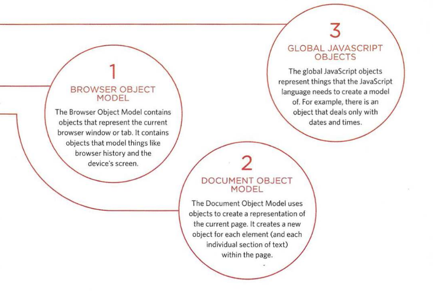
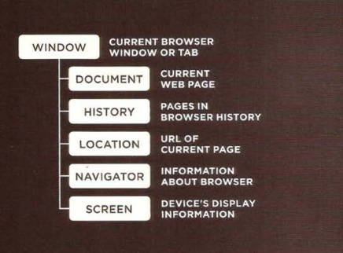
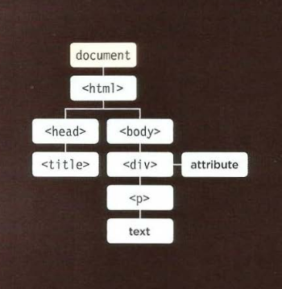
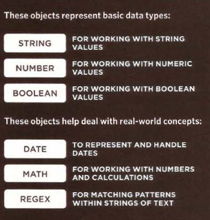
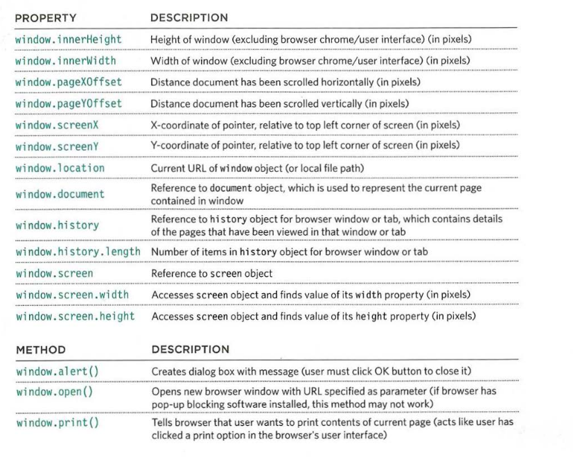

# Three groups of built-in objects

**_:information_source::information_source::information_source: Browsers come with a set of built-in objects that represent things like the browser window and the current web page shown in that window. These built-in objects act like a toolkit for creating interactive web pages._**

The first thing you need to do is get to know what tools are available. You can imagine that your new toolkit has three compartments:

- BOM.
- DOM.
- Global javascript objects.



## BOM

All objects are created inside global object called `window` which is representing the current window or tab. It is also representing the `BOM` object.



## DOM

The `Document Object Model` creates a model of the current web page. The topmost object is the `document` object, which representing the page as a whole. Its child objects represent other items on page.



## Global JavaScript Objects

The global objects do not form a single model. They are a group of individual objects that relate to different parts of the javascript language.

Name of the global objects always start with `Capital letter` example: `String`, `Date`, `Number`, etc.



# Simple example about BOM

The window object represents the current browser window or tab. It is the topmost object in the Browser Object Model, and it contains other objects that tell you about the browser.



example found in **Examples/c03/js/window-object.js**

**HTML**

```html
<!DOCTYPE html>
<html>
  <head>
    <title>
      JavaScript &amp; jQuery - Chapter 3: Functions, Methods &amp; Objects -
      Window Object
    </title>
    <link rel="stylesheet" href="css/c03.css" />
  </head>
  <body>
    <h1>TravelWorthy</h1>
    <div id="info"></div>
    <script src="js/window-object.js"></script>
  </body>
</html>
```

**JavaScript**

```js
// Create a variable called msg to hold a message that will be shown on the page
// Find the width of the browser window, and put this in the msg variable
var msg = "<h2>browser window</h2><p>width: " + window.innerWidth + "</p>";
// Find the height of the window and add it to the msg variable
msg += "<p>height: " + window.innerHeight + "</p>";
// Find the number of items in the browser window's history and add it to the msg variable
msg += "<h2>history</h2><p>items: " + window.history.length + "</p>";
// Find the width of the computer screen and add it to the msg variable
msg += "<h2>screen</h2><p>width: " + window.screen.width + "</p>";
// Find the height of the computer screen and add it to the msg variable
msg += "<p>height: " + window.screen.height + "</p>";

// Create a variable called el to hold the element whose id attribute has a value of info
var el = document.getElementById("info");
// Write the message into that element
el.innerHTML = msg;
// Find the location of the current page and display it in an alert box
alert("Current page: " + window.location);
```

---

### References and Terms:

> :gem: Check out [Standard objects](https://developer.mozilla.org/en-US/docs/Web/JavaScript).
