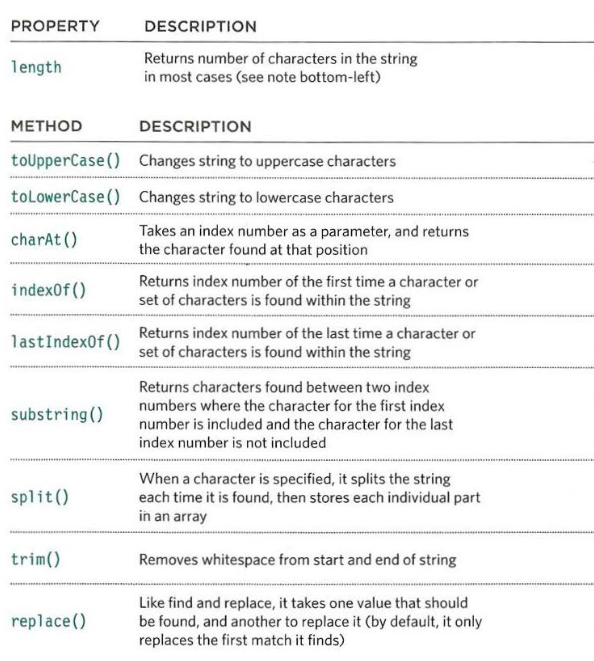
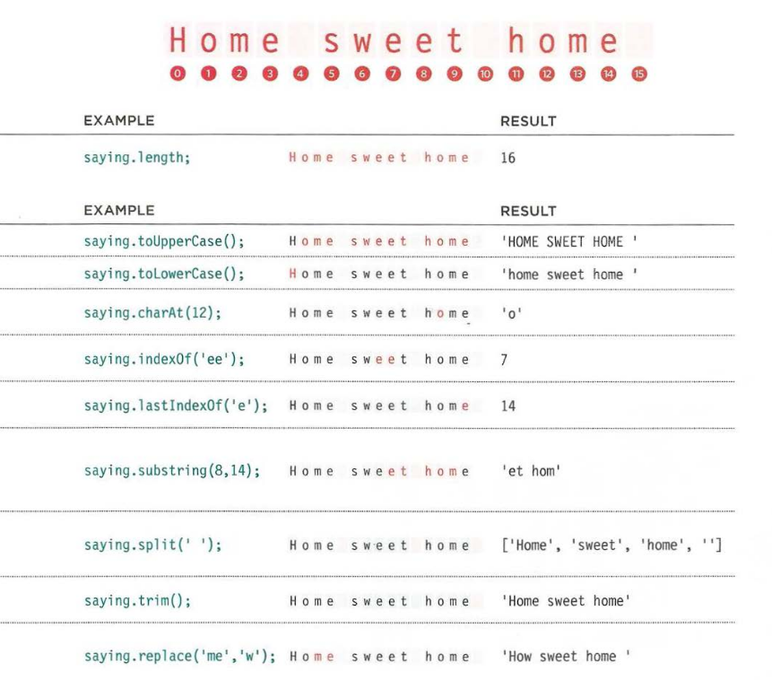

# String global objects (Built in object)

Whenever you have a value that is a string, you can use the properties and methods of the String object on that value. This example stores the phrase "Home sweet home " in a variable.

```js
let saying = "Home sweet home ";
```

When you declare a variable in JavaScript, It will be wrapped under the hood with objects according to the type of the variable. In our example we define a string and for that javaScript wrap the variable with special methods that we can use. The methods are:



Each character in a string is automatically given a number, called an `index` number. Index numbers always start at **zero** and not one (just like for items in an array).



```js
// Ahmed write them c03/js/string-object.js Program
```
