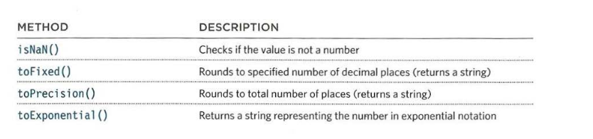

# Number global object

Whenever you have a value that is a number, you can use the methods and properties of the
`Number` object on it.



example found in **Examples/c03/js/number-object.js**

**HTML**

```html
<!DOCTYPE html>
<html>
  <head>
    <title>
      JavaScript &amp; jQuery - Chapter 3: Functions, Methods &amp; Objects -
      Number Object
    </title>
    <link rel="stylesheet" href="css/c03.css" />
  </head>
  <body>
    <h1>TravelWorthy</h1>
    <div id="info"></div>
    <script src="js/number-object.js"></script>
  </body>
</html>
```

**JavaScript**

```js
// Create a variable to hold the number that will be used
var originalNumber = 10.23456;
// Create a variable to hold a message that will be shown on the page
var msg = "<h2>original number</h2><p>" + originalNumber + "</p>";
// Round the number to 3 decimal places and add it to the msg variable
msg += "<h2>3 decimal places</h2><p>" + originalNumber.toFixed(3);
+"</p>";
// Round the number to a precisely 3 digits and add it to the msg variable
msg += "<h2>3 digits</h2><p>" + originalNumber.toPrecision(3) + "</p>";

// Create a variable called el to hold the element whose id attribute has a value of info
var el = document.getElementById("info");
// Write the message into that element
el.innerHTML = msg;
```
