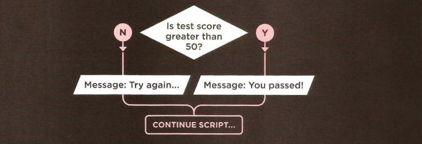
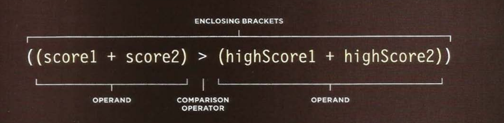

# DECISION AND LOOPS

Looking at a flowchart (for all but the most basic scripts), the code can take more than one path, which means the browser runs different code in different situations. In this chapter, you will learn how to create and control the flow of data in your scripts to handle different situations.

There are often several places in a script where decisions are made that determine which lines of code should be run next. Flowcharts can help you plan for these occasions.



## EVALUATING CONDITIONS AND CONDITIONAL STATEMENT

There are two components to decision:

- An expression is evaluated, which returns a value
- A conditional statement says what to do in a given situation.

```js
if (score > 50) {
  // Expression to evaluate
  alert("You passed!"); // Conditional statement to be done when condition is passed
} else {
  alert("Try again..."); // Conditional statement to be done when condition is failed.
}
```

## COMPARISON OPERATORS

| Comparison operator | Meaning                        | Example |
| ------------------- | ------------------------------ | ------- |
| ==                  | **_Is Equal_**                 |         |
| !=                  | **_Is Not Equal_**             |         |
| ===                 | **_Strickt Equal To_**         |         |
| !==                 | **_Strickt Not Equal To_**     |         |
| >                   | **_Greater Than_**             |         |
| <                   | **_Less Than_**                |         |
| >=                  | **_Greater Than Ot Equal To_** |         |
| <=                  | **_Less Than Or Equal To_**    |         |

## STRUCTURING COMPARISON OPERATORS

In any condition, there is usually one operator and two operands. The operands are placed on each side of the operator. They can be values or variables. You often see expressions enclosed in brackets.


example found in **[Examples/c04/comparison-operator.html](../Examples/c04/comparison-operator.html)**

**HTML**

```html
<html>
  <head>
    <title>
      JavaScript &amp; jQuery - Chapter 4: Decisions &amp; Loops - Comparison
      Operator
    </title>
    <link rel="stylesheet" href="css/c04.css" />
  </head>
  <body>
    <section id="page1">
      <h1>Bullseye</h1>
      
      <section id="answer"></section>
    </section>
    <script src="js/comparison-operator.js"></script>
  </body>
</html>
```

**JavaScript**

```js
// Ahmed write them  Program
var pass = 50; // Pass mark
var score = 90; // Score

// Check if the user has passed
var hasPassed = score >= pass;

// Write the message into the page
var el = document.getElementById("answer");
el.innerHTML = "Level passed: " + hasPassed;
```

## USING EXPRESSIONS WITH COMPARISON OPERATORS

The operand dose not have to be a single value or variable name. An operand can be an expression (Because each expression evaluates into a single value).



example found in **[Examples/c04/comparison-operator-continued.html](../Examples/c04/comparison-operator-continued.html)**

**HTML**

```html
<!DOCTYPE html>
<html>
  <head>
    <title>
      JavaScript &amp; jQuery - Chapter 4: Decisions &amp; Loops - Comparison
      Operator Continued
    </title>
    <link rel="stylesheet" href="css/c04.css" />
  </head>
  <body>
    <section id="page1">
      <h1>Bullseye</h1>
      
      <section id="answer"></section>
    </section>
    <script src="js/comparison-operator-continued.js"></script>
  </body>
</html>
```

**JavaScript**

```js
var score1 = 90; // Round 1 score
var score2 = 95; // Round 2 score
var highScore1 = 75; // Round 1 high score
var highScore2 = 95; // Round 2 high score

// Check if scores are higher than current high scores
var comparison = score1 + score2 > highScore1 + highScore2;

// Write the message into the page
var el = document.getElementById("answer");
el.innerHTML = "New high score: " + comparison;
```

## LOGICAL OPERATORS

| Comparison operator | Meaning           | Example               | Result |
| ------------------- | ----------------- | --------------------- | ------ |
| &&                  | **_Logical And_** | ((2 < 5) && (3 >= 2)) | true   |
| \|\|                | **_Logical Or_**  | ((2 < 5) && (2 < 1))  | true   |
| !                   | **_Logical Not_** | !(2 < 1)              | false  |

### UNDERSTANDING LOGICAL AND (&&)

| Operand 1 | Logical operation | Operand 2 | Result  |
| --------- | ----------------- | --------- | ------- |
| false     | &&                | false     | `false` |
| false     | &&                | true      | `false` |
| true      | &&                | false     | `false` |
| true      | &&                | true      | `true`  |

### UNDERSTANDING LOGICAL OR (||)

| Operand 1 | Logical operation | Operand 2 | Result  |
| --------- | ----------------- | --------- | ------- |
| false     | \|\|              | false     | `false` |
| false     | \|\|              | true      | `true`  |
| true      | \|\|              | false     | `true`  |
| true      | \|\|              | true      | `true`  |

### UNDERSTANDING LOGICAL NOT (!)

| Logical operation | Operand 1 | Result  |
| ----------------- | --------- | ------- |
| !                 | false     | `true`  |
| !                 | true      | `false` |

example found in **[Examples/c04/logical-and..html](../Examples/c04/logical-and..html)**

**HTML**

```html
<!DOCTYPE html>
<html>
  <head>
    <title>
      JavaScript &amp; jQuery - Chapter 4: Decisions &amp; Loops - Logical And
    </title>
    <link rel="stylesheet" href="css/c04.css" />
  </head>
  <body>
    <section id="page1">
      <h1>Bullseye</h1>
      
      <section id="answer"></section>
    </section>
    <script src="js/logical-and.js"></script>
  </body>
</html>
```

**JavaScript**

```js
var score1 = 8; // Round 1 score
var score2 = 8; // Round 2 score
var pass1 = 6; // Round 1 pass mark
var pass2 = 6; // Round 2 pass mark

// Check whether user passed both rounds, store result in variable
var passBoth = score1 >= pass1 && score2 >= pass2;

// Create message
var msg = "Both rounds passed: " + passBoth;

// Write the message into the page
var el = document.getElementById("answer");
el.innerHTML = msg;
```

Another example found in **[Examples/c04/logical-or-logical-not.html](../Examples/c04/logical-or-logical-not.html)**

**HTML**

```html
<!DOCTYPE html>
<html>
  <head>
    <title>
      JavaScript &amp; jQuery - Chapter 4: Decisions &amp; Loops - Logical OR
      and Logical NOT
    </title>
    <link rel="stylesheet" href="css/c04.css" />
  </head>
  <body>
    <section id="page1">
      <h1>Bullseye</h1>
      
      <section id="answer"></section>
    </section>
    <script src="js/logical-or-logical-not.js"></script>
  </body>
</html>
```

**JavaScript**

```js
var score1 = 8; // Round 1 score
var score2 = 8; // Round 2 score
var pass1 = 6; // Round 1 pass mark
var pass2 = 6; // Round 2 pass mark

// Check whether user passed one of the two rounds, store result in variable
var minPass = score1 >= pass1 || score2 >= pass2;

// Create message
var msg = "Resit required: " + !minPass;

// Write the message into the page
var el = document.getElementById("answer");
el.innerHTML = msg;
```
