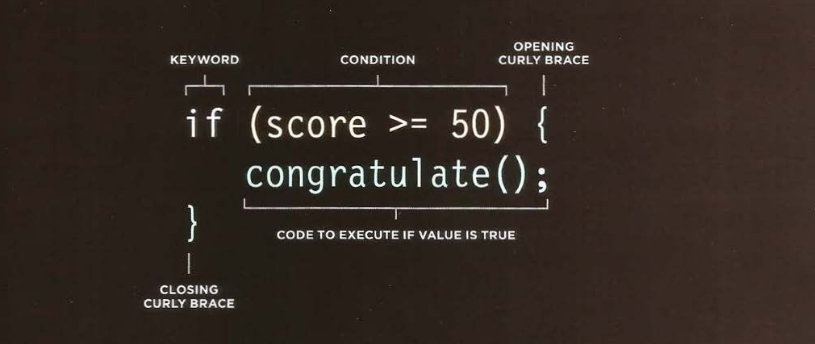
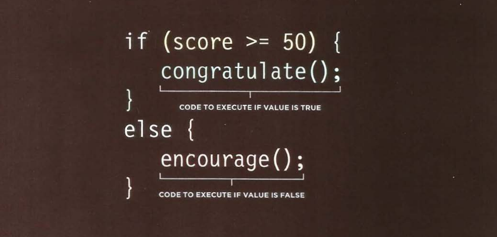

# IF AND IF...ELSE STATEMENT

The `if` statement evaluates (or check) a conditi
on. If the condition evaluates to `true`, any statements in the subsequent code block are executed.



example found in **[Examples/c04/if-statement.html](../Examples/c04/if-statement.html)**

**HTML**

```html
<!DOCTYPE html>
<html>
  <head>
    <title>
      JavaScript &amp; jQuery - Chapter 4: Decisions &amp; Loops - If Statement
    </title>
    <link rel="stylesheet" href="css/c04.css" />
  </head>
  <body>
    <section id="page1">
      <h1>Bullseye</h1>
      
      <section id="answer"></section>
    </section>
    <script src="js/if-statement.js"></script>
  </body>
</html>
```

**JavaScript**

```js
var score = 75; // Score
var msg; // Message

if (score >= 50) {
  // If score is 50 or higher
  msg = "Congratulations!";
  msg += " Proceed to the next round.";
}

var el = document.getElementById("answer");
el.textContent = msg;
```

Another example found in **[Examples/c04/if-statement-with-function.html](../Examples/c04/if-statement-with-function.html)**

**HTML**

```html
<!DOCTYPE html>
<html>
  <head>
    <title>
      JavaScript &amp; jQuery - Chapter 4: Decisions &amp; Loops - If Statement
      with Function
    </title>
    <link rel="stylesheet" href="css/c04.css" />
  </head>
  <body>
    <section id="page1">
      <h1>Bullseye</h1>
      
      <section id="answer"></section>
    </section>
    <script src="js/if-statement-with-function.js"></script>
  </body>
</html>
```

**JavaScript**

```js
var score = 75; // Score
var msg = ""; // Message

function congratulate() {
  msg += "Congratulations! ";
}

if (score >= 50) {
  // If score is 50 or more
  congratulate();
  msg += "Proceed to the next round.";
}

var el = document.getElementById("answer");
el.innerHTML = msg;
```

## IF...ELSE STATMENT

The `if...else` statment checks a condition. If it resolves to `true`, the first code block is executed.
If the condition resolves to `false` the second code block is run instead.



example found in **[Examples/c04/if-else-statement.html](../Examples/c04/if-else-statement.html)**

**HTML**

```html
<!DOCTYPE html>
<html>
  <head>
    <title>
      JavaScript &amp; jQuery - Chapter 4: Decisions &amp; Loops - If... Else
      Statement
    </title>
    <link rel="stylesheet" href="css/c04.css" />
  </head>
  <body>
    <section id="page1">
      <h1>Bullseye</h1>
      
      <section id="answer"></section>
    </section>
    <script src="js/if-else-statement.js"></script>
  </body>
</html>
```

**JavaScript**

```js
var pass = 50; // Pass mark
var score = 75; // Current score
var msg; // Message

// Select message to write based on score
if (score > pass) {
  msg = "Congratulations, you passed!";
} else {
  msg = "Have another go!";
}

var el = document.getElementById("answer");
el.textContent = msg;
```
