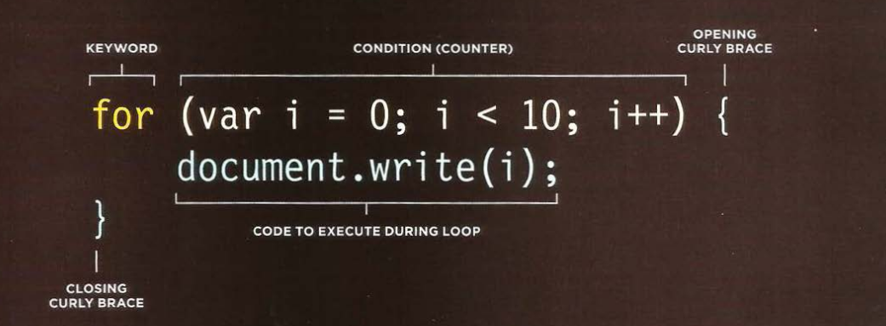
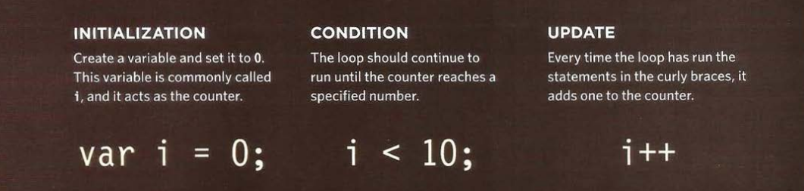

# LOOPS

Loops check a condition. If it returns `true`, a code block will run. Then the condition will be checked again and if it still returns `true`, the code block will run again. It repeats until the condition returns `false`. There are three common types of loop:

- For (The most common loop)
  - If you need to run code a specific number if times.
  - The condition is usually a counter which is used to tell how many times the loop should run.
- While
  - If you do not know how many tiles the code should run, you can use `while` loop.
  - Here the condition can be something other than a counter, and the code will continue to loop for as long as the condition is `true`.
- Do ... While
  - Similar to `while` loop but always run the code inside the curly braces at least once, even if the condition evaluated to `false`.

## FOR LOOP




## KEY OF LOOP CONCEPTS

1. In some cases you can find `break` or `continue`. They are used to control the follow of the loop.
2. If you don't control your loop condition correctly the loop get into `infinite loop`.

example found in **[Examples/c04/for-loop.html](../Examples/c04/for-loop.html)**

**HTML**

```html
<!DOCTYPE html>
<html>
  <head>
    <title>
      JavaScript &amp; jQuery - Chapter 4: Decisions &amp; Loops - For Loop
    </title>
    <link rel="stylesheet" href="css/c04.css" />
  </head>
  <body>
    <section id="page1">
      <h1>Bullseye</h1>
      
      <section id="answer"></section>
    </section>
    <script src="js/for-loop.js"></script>
  </body>
</html>
```

**JavaScript**

```js
var scores = [24, 32, 17]; // Array of scores
var arrayLength = scores.length; // Items in array
var roundNumber = 0; // Current round
var msg = ""; // Message

// Loop through the items in the array
for (var i = 0; i < arrayLength; i++) {
  // Arrays are zero based (so 0 is round 1)
  // Add 1 to the current round
  roundNumber = i + 1;

  // Write the current round to message
  msg += "Round " + roundNumber + ": ";

  // Get the score from the scores array
  msg += scores[i] + "<br />";
}

document.getElementById("answer").innerHTML = msg;
```

example found in **[Examples/c04/while-loop.html](../Examples/c04/while-loop.html)**

**HTML**

```html
<!DOCTYPE html>
<html>
  <head>
    <title>
      JavaScript &amp; jQuery - Chapter 4: Decisions &amp; Loops - While Loop
    </title>
    <link rel="stylesheet" href="css/c04.css" />
  </head>
  <body>
    <section id="page1">
      <h1>Bullseye</h1>
      
      <section id="answer"></section>
    </section>
    <script src="js/while-loop.js"></script>
  </body>
</html>
```

**JavaScript**

```js
var i = 1; // Set counter to 1
var msg = ""; // Message

// Store 5 times table in a variable
while (i < 10) {
  msg += i + " x 5 = " + i * 5 + "<br />";
  i++;
}

document.getElementById("answer").innerHTML = msg;
```

example found in **[Examples/c04/do-while-loop.html](../Examples/c04/do-while-loop.html)**

**HTML**

```html
<!DOCTYPE html>
<html>
  <head>
    <title>
      JavaScript &amp; jQuery - Chapter 4: Decisions &amp; Loops - Do While Loop
    </title>
    <link rel="stylesheet" href="css/c04.css" />
  </head>
  <body>
    <section id="page1">
      <h1>Bullseye</h1>
      
      <section id="answer"></section>
    </section>
    <script src="js/do-while-loop.js"></script>
  </body>
</html>
```

**JavaScript**

```js
var i = 1; // Set counter to 1
var msg = ""; // Message

// Store 5 times table in a variable
do {
  msg += i + " x 5 = " + i * 5 + "<br />";
  i++;
} while (i < 1);
// Note how this is already 1 and it still runs

document.getElementById("answer").innerHTML = msg;
```

---

### REFERENCES AND TERMS:

> :information_source: If you use a data type JavaScript did not expect, JavaScript tries to make scense of the operation rather than reporting an error. This called `Coercion`
