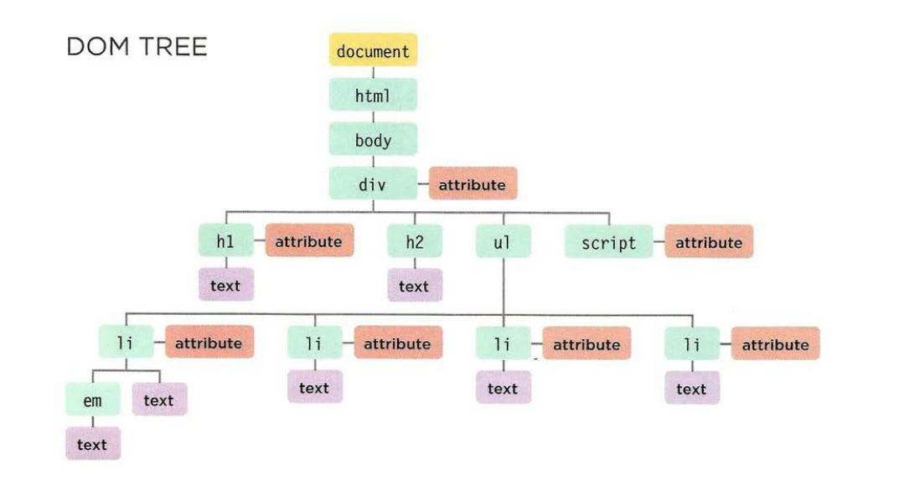
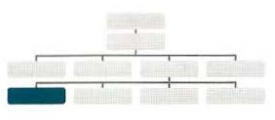
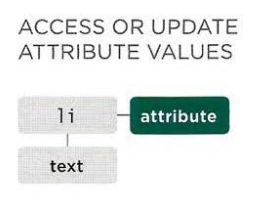

# DOM tree is a model of a web page

As a browser loads a web page, it creates a model of that page. The model is called a `DOM tree`, and it is stored in the browser's memory. It consists of four main types of nodes.

```html
<html>
  <body>
    <div id="page">
      <h1 id="header">List</h1>
      <h2>Buy groceries</h2>
      <ul>
        <li id="one" class="hot"><em>fresh</em>figs</li>
        <li id="two" class="hot">pine nuts</li>
        <li id="three" class="hot">honey</li>
        <li id="four">balsamic vinegar</li>
      </ul>
      <script src="js/list.js"></script>
    </div>
  </body>
</html>
```

1. <span style="color:yellow">Document node</span>.
2. <span style="color:lightgreen">Element node.</span>
3. <span style="color:orange">Attribute nodes.</span>.
4. <span style="color:purple">Text nodes.</span>.



Each node is an object with methods and properties.
Scripts access and update this DOM tree (not the source HTML file)(Original file remain the same). Any changes made to the DOM tree are reflected in the browser.

## Working with the DOM tree

Accessing and updating the DOM tree involves two steps:

1. Locate the node that represents the element you want to work with.
2. Use its text content, child elements, and attributes.

### 1. Accessing The Element:

- By selecting an individual element.
- By selecting multiple elements (Nodelists)
- Traversing between element nodes.

| Selecting individual element            | Selecting multiple element             | Traversing between elements     |
| --------------------------------------- | -------------------------------------- | ------------------------------- |
|  |             |  |
| `getElementById('ID_NAME')`             | `getElementsByClassName('CLASS_NAME')` | `parentNode`                    |
| `querySelector('CSS_SELECTOR')`         | `getElementsByTagName(HTML_TAG_NAME')` | `previousSibling / nextSibling` |
|                                         | `querySelectorAll('CSS_SELECTOR')`     | `firstChild / lastChild`        |

### 2. Working with those Elements:

| Access / Update text nodes                                                        | Work with HTML content                       | Access / Update attribute values   |
| --------------------------------------------------------------------------------- | -------------------------------------------- | ---------------------------------- |
|                                                |           |       |
| 1. Select the \<li> element.                                                      | `innerHTML` Working with HTML inner elements | `ELEMENT.className` / `ELEMENT.id` |
| 2. Use the `firstChild` property to get the text node                             | `textContent` Only with text content         |                                    |
| 3. Use the text node's only property `nodeValue` to get the text from the element |                                              |                                    |

## Working with HTML content by create and removing element (Work with HTML content):

By using the following methods in `document` object, we can create and delete HTML elements.

```html
<body>
  <body></body>
</body>
```

```js
let header = document.createElement("h1");
let text = document.createTextNode("Header text");
header.appendChild(text);
document.body.appendChild(header);
```

## Let us play a bit with attributes (Access / Update attribute values)

By using the most important attributes like:

- `hasAttribute()`
- `getAttribute()`
- `removeAttribute()`

we can do some advance attribute and control out html tags.

```html
<body></body>
```

```js
let image = document.createElement("img");
image.src = "http://meowgifs.com/wp-content/uploads/2014/10/shake-it.gif";
image.className = "image-of-cat";
document.body.appendChild(image);

let myImage = document.querySelector(".image-of-cat");
alert(myImage.getAttribute("src"));
```

## Caching DOM queries

**_When you need to work with an element more than once, you should use a variable to store the result of this query._**
**_Storing a DOM tree in a variable means of storing the location of the element(s) within the DOM tree in a variable. The properties and methods of that element node works on the variable._**


