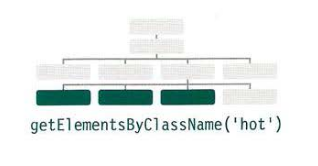
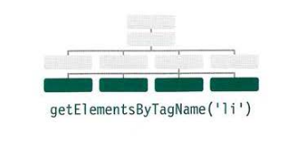
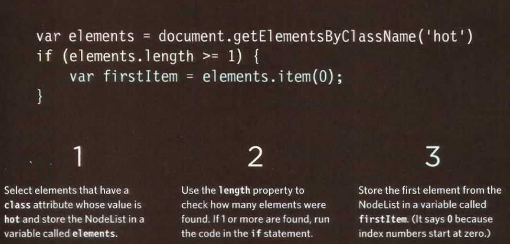

# Accessing elements

DOM queries may return one element, or they may return a Node list, which is a collection of nodes.

### getElementById('id')

Selects an individual element given the value of its `id attribute`. The HTML must have an id attribute in order for it to be selectable.

**First supported:** `IE5.5, Opera 7, all versions of Chrome, Firefox, Safari.`


### querySelector('CSS SELECTOR')

Uses CSS selector syntax t hat would select one or more elements . This method returns only the first of the matching elements.

**First supported:** `IE8, Firefox 3.5, Safari 4 . Chrome 4, Opera 10`


**_METHO DS THAT RETURN ONE OR MORE ELEMENTS (AS A NODE LIST):_**

### getElementsByClassName('CLASS NAME')

Selects one or more elements given the value of their class attribute. he HTML must have a class attribute for it to be selectable. This method is faster than `querySelectorAll()`.

**_First supported:_** `IE9, Firefox 3, Safari 4 , Chrome 4 , Opera 10 (Several browsers had partial I buggy support in earlier versions)`



### getElementsByTagName('HTML TAG NAME')

Selects all elements on the page with the specified tag name. This method is faster than `querySelectorAll()`.

**_First supported:_** `IE6+, Firefox 3, Safari 4, Chrome, Opera 10 (Several browsers had partial I buggy support in earlier versions)`



### querySelectorAll('CSS SELECTOR')

Uses CSS selector syntax to select one or more element s and returns all of those t hat match.

**_First supported:_** `IE8, Firefox 3.5, Safa ri 4, Chrome 4, Opera 10`


## SELECTING ELEMENTS USING ID ATTRIBUTES

Let us see the following example found in **[Examples/c05/get-elements-by-id.html](../Examples/c05/get-elements-by-id.html)**

```HTML
<h1 id="header">List King</h1>
<h2>Buy groceries</h2>
<ul>
    <li id="one" class="hot">
        <em>fresh</em>figs
    </li>
    <li id="two" class="hot">pine nuts</li>
    <li id="three" class="hot">honey</li>
    <li id="four">balsamic vinegar</li>
</ul>
```

```js
// Select the element and store it in a variable.
var el = document.getElementById("one");
// Change the value of the class attribute.
el.className = "cool";
```

## NODELISTS: DOM QUERIES THAT RETURN MORE THAN ONE ELEMENT

When a DOM method can return more than one element, it returns a Nodelist (even if it only finds one matching element).

_"Nodelists look like arrays and are numbered like arrays, but they are not act actually arrays, they are a type of object called a `collection`."_

1. When a DOM query returns a Nodelist, you may want to:

   - Select one element from the NodeList.
   - Loop through each item in the Nodelist and perform the same statements on each of the element nodes.

2. Like any other object, a Nodelist has properties and methods, notably:
   - The `length` property tells you how many it items are in the Nodelist.
   - The `item()` method returns a specific node from the Nodelist when you tell it the index number of the item t hat you want (in the parentheses).

## Selecting an element from Nodelist

There are two ways to select element from NodeList:

1. Using `item()` method
2. Array syntax.

**Both** require the **index number** of the element you want.

**Using item() method**


**Note that:**

1. Array syntax is preferred over the item() method because it is faster.
2. Before selecting a node from a NodeList, check that it containes nodes.
3. If you repeatedly use the NodeList, store them in a `variable`.

**Using array syntax**


---

## Examples

Here we have HTML and CSS:

**HTML**

```HTML
<!DOCTYPE html>
<html>
  <head>
    <title>JavaScript &amp; jQuery - Chapter 5: Document Object Model - Get Elements By Class Name</title>
    <meta name="viewport" content="width=device-width, initial-scale=1.0">
    <link rel="stylesheet" href="css/c05.css">
  </head>
  <body>
    <div id="page">
      <h1 id="header">List</h1>
      <h2>Buy groceries</h2>
      <ul>
        <li id="one" class="hot"><em>fresh</em> figs</li>
        <li id="two" class="hot">pine nuts</li>
        <li id="three" class="hot">honey</li>
        <li id="four">balsamic vinegar</li>
      </ul>
    </div>
    <script src="js/get-elements-by-class-name.js"></script>
  </body>
</html>
```

**CSS**

```css
@import url(http://fonts.googleapis.com/css?family=Oswald);

body {
  background-color: #000;
  font-family: "Oswald", "Futura", sans-serif;
  margin: 0px;
  padding: 0px;
}

#page {
  background-color: #403c3b;
  margin: 0px auto 0px auto;
}
/* Responsive page rules at bottom of style sheet */

h1 {
  background-image: url(../images/kinglogo.png);
  background-repeat: no-repeat;
  background-position: center center;
  text-align: center;
  text-indent: -1000%;
  height: 75px;
  line-height: 75px;
  width: 117px;
  margin: 0px auto 0px auto;
  padding: 30px 10px 20px 10px;
}

h2 {
  color: #fff;
  font-size: 24px;
  font-weight: normal;
  text-align: center;
  text-transform: uppercase;
  letter-spacing: 0.2em;
  margin: 0px 0px 23px 0px;
}

h2 span {
  border-radius: 50%;
  background-color: #000;
  font-size: 10px;
  text-align: center;
  display: inline-block;
  position: relative;
  top: -5px;
  height: 18px;
  width: 20px;
  margin-left: 5px;
  padding: 4px 0px 0px 4px;
}

ul {
  background-color: #584f4d;
  border: none;
  padding: 0px;
  margin: 0px;
}

li {
  background-color: #ec8b68;
  color: #fff;
  border-top: 1px solid #fe9772;
  border-bottom: 1px solid #9f593f;
  font-size: 24px;
  letter-spacing: 0.05em;
  list-style-type: none;
  text-shadow: 2px 2px 1px #9f593f;
  height: 50px;
  padding-left: 1em;
  padding-top: 10px;
}

.hot {
  background-color: #d7666b;
  color: #fff;
  text-shadow: 2px 2px 1px #914141;
  border-top: 1px solid #e99295;
  border-bottom: 1px solid #914141;
}

.cool {
  background-color: #6cc0ac;
  color: #fff;
  text-shadow: 2px 2px 1px #3b6a5e;
  border-top: 1px solid #7ee0c9;
  border-bottom: 1px solid #3b6a5e;
}

.complete {
  background-color: #999;
  color: #fff;
  background-image: url("../images/icon-trash.png");
  background-position: center right;
  background-repeat: no-repeat;
  text-shadow: 2px 2px 1px #ccc;
  border-top: 1px solid #666;
  text-shadow: 2px 2px 1px #333;
}

li a {
  color: #fff;
  text-decoration: none;
  background-image: url("../images/icon-link.png");
  background-position: center right;
  background-repeat: no-repeat;
  padding-right: 36px;
}

p {
  color: #403c3b;
  background-color: #fff;
  border-radius: 5px;
  text-align: center;
  padding: 10px;
  margin: 20px auto 20px auto;
  min-width: 20%;
  max-width: 80%;
}

#scriptResults {
  padding-bottom: 10px;
}

/* Small screen - acts like the app would */
@media only screen and (max-width: 500px) {
  body {
    background-color: #584f4d;
  }
  #page {
    max-width: 480px;
  }
}
@media only screen and (min-width: 501px) and (max-width: 767px) {
  #page {
    max-width: 480px;
    margin: 20px auto 20px auto;
  }
}
@media only screen and (min-width: 768px) and (max-width: 959px) {
  #page {
    max-width: 480px;
    margin: 20px auto 20px auto;
  }
}
/* Larger screens act like a demo for the app */
@media only screen and (min-width: 960px) {
  #page {
    max-width: 480px;
    margin: 20px auto 20px auto;
  }
}
@media (-webkit-min-device-pixel-ratio: 2), (min-resolution: 192dpi) {
  h1 {
    background-image: url(../images/2xkinglogo.png);
    background-size: 72px 72px;
  }
}
```

#### Selecting elements using Class Attributes:

JavaScript found for this example found in **[Examples/c05/get-element-by-class-name.html](../Examples/c05/get-element-by-class-name.html)**

**JavaScript**

```js
var elements = document.getElementsByClassName("hot"); // Find hot items

if (elements.length > 2) {
  // If 3 or more are found

  var el = elements[2]; // Select the third one from the NodeList
  el.className = "cool"; // Change the value of its class attribute
}
```

#### Selecting elements By Tag Name:

JavaScript found for this example found in **[Examples/c05/get-elements-by-tag-name.html](../Examples/c05/get-elements-by-tag-name.html)**

**JavaScript**

```js
var elements = document.getElementsByTagName("li"); // Find <li> elements

if (elements.length > 0) {
  // If 1 or more are found

  var el = elements[0]; // Select the first one using array syntax
  el.className = "cool"; // Change the value of the class attribute
}
```

#### Selecting elements using CSS Selectors:

JavaScript found for this example found in **[Examples/c05/query-selector.html](../Examples/c05/query-selector.html)**

**JavaScript**

```js
// querySelector only returns the first match.
var el = document.querySelector("li.hot");
el.className = "cool";

// querySelectorAll returns a NodeList.
// The third li element is then selected and changed.
var els = document.querySelectorAll("li.hot");
els[1].className = "cool";
```
