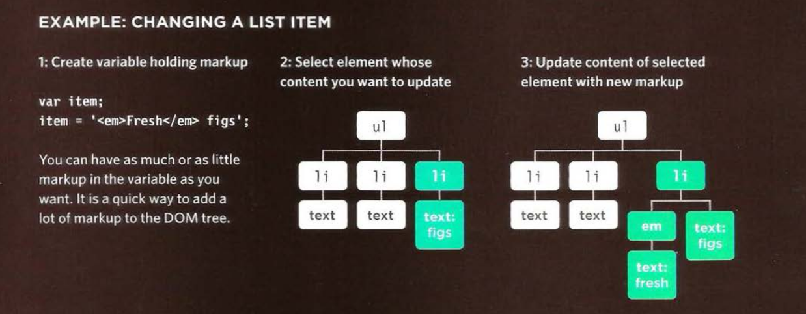
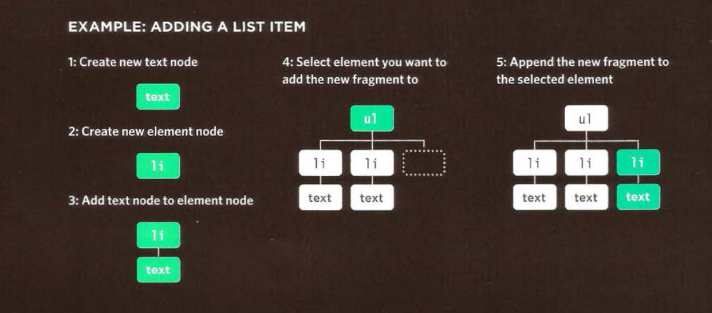

# Adding Or Removing HTML content

## Adding HTML contents:

There are two very different approaches to adding and removing content from a DOM tree:

1. `innerHTML` property.
2. DOM manipulation.

## 1. The innerHTML property:

See the following figure:



## 2. DOM manipulation:

See the following figure:



**_DOM manipulation easily targets individual nodes in the DOM tree, whereas `innerHTML` is better suited to updating entire fragments._**

Let us get deep wit them.

## (innerHTML) Accessing and Updating text and markup

Using the `innerHTML` property, you can access and modify the contents of an element, including any child elements.


### GET content

To collect the content of the list item and add it to a variable called `elContent`.

```js
let elContent = document.getElementById("one").innerHTML;
```

The `elContent` variable would now hold the `string`: `\<em>fresh\</em> figs`

### SET content

Adding content of the `elContent` variable (including any markup) to the first list item:

```js
document.getElementById("one").innerHTML = elContent;
```

example **c05/js/inner-html.js**

```js
// Store the first list item in a variable
var firstItem = document.getElementById("one");

// Get the content of the first list item
var itemContent = firstItem.innerHTML;

// Update the content of the first list item so it is a link
firstItem.innerHTML = '<a href="http://example.org">' + itemContent + "</a>";
```

## (DOM manipulation) Adding Elements using DOM manipulation

DOM manipulation offers another technique to add new content to a page (rather than innerHTML). It involves three steps:

1. Creating Element by using `createElement()` method.
2. Give it content by using `createTextNode()` method.
3. Add it to the DOM by using `appendChild()` method.

example **c05/js/add-element.js**

```js
// Create a new element and store it in a variable.
var newEl = document.createElement("li");

// Create a text node and store it in a variable.
var newText = document.createTextNode("quinoa");

// Attach the new text node to the new element.
newEl.appendChild(newText);

// Find the position where the new element should be added.
var position = document.getElementsByTagName("ul")[0];

// Insert the new element into its position.
position.appendChild(newEl);
```

## Removing HTML elements via DOM manipulation:

DOM manipulation can be used to remove elements from the DOM tree. (In general computer science, there is no deleting in specific meaning but more that updating with empty contents or writing with empty contents).

Removing will go through three steps:

1. Store the element that you want to remove in a variable (By the same way of selecting elements).
2. Store the parent of that element in a variable.
3. Remove the element that you have stored in the first step with the following `removeChild(STORED_ELEMENT_THAT_YOU_WANT_TO_REMOVE)` method.

example found in **[Examples/c05/remove-element.html](../Examples/c05/remove-element.html)**

```js
// Store the element to be removed in a variable.
var removeEl = document.getElementsByTagName("li")[3];

// Find the element which contains the element to be removed.
var containerEl = document.getElementsByTagName("ul")[0];

// Remove the element.
containerEl.removeChild(removeEl);
```

## Comparing techniques:

### Advantages:

| element.innerHTML                                                                                     | DOM manipulation                                                                                                 |
| ----------------------------------------------------------------------------------------------------- | ---------------------------------------------------------------------------------------------------------------- |
| 1. You can use it to add a lot of new markup using less code than DOM manipulation methods.           | 1. It is suited to changing one element from a DOM fragment where there are many siblings.                       |
| 2. It can be faster than DOM manipulation when adding a lot of new elements to a web page.            | 2. It does not affective handlers.                                                                               |
| 3. It is a simple way to remove all of the content from one element (by assigning it a blank string). | 3. It easily allows a script to add elements incrementally (when you do not want to alter a lot of code at once) |

### Disadvantages:

| element.innerHTML                                                                                                                                                          | DOM manipulation                                                                                 |
| -------------------------------------------------------------------------------------------------------------------------------------------------------------------------- | ------------------------------------------------------------------------------------------------ |
| 1. It should not be used to add content that has come from a user (such as a username or blog comment), as it can pose a significant security risk which is discussed next | 1. If you have to make a lot of changes to the content of a page, it is slower than `innerHTML`. |
| 2. It can be difficult to isolate single elements that you want to update within a larger DOM                                                                              | 2. You need to write more code to achieve the same thing compared with `innerHTML`.              |

Take a look at the same example of \<li> elements bellow. Each one adds some more markup and, as a result, the fragment of the DOM tree for each
list item is very different.
