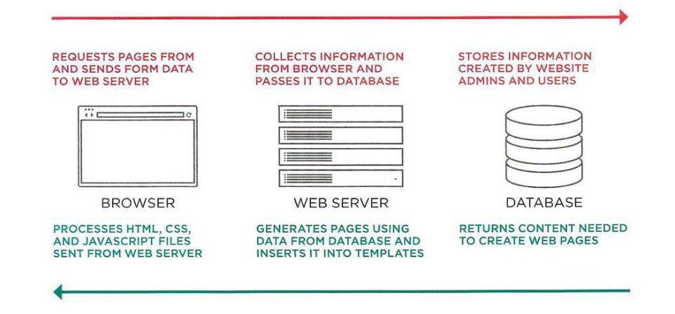

# Cross site scripting attacks (XSS)

If you add HTML to a page using `innerHTML` (or several `jQuery` methods), you need to be aware of Cross-Site Scripting Attacks or XSS, otherwise, an attacker could gain access to your users' accounts.

## How XSS happens?

XSS involves an attacker placing malicious code into a site. Websites often feature content created by many different people. For example:

- Users can create profiles or add comments.
- Multiple authors may contribute articles.
- Data can come from third-party sites such as Facebook, Twitter, news tickets, other feeds.
- File such as images and video may be uploaded.

## What can these attacks do?

XSS can give the attacker access to information in:

- The DOM (including form data).
- That websites cookies.
- Session tokens, information that identifies you from other users when log into the site.

This could let the attacker access a user account and:

- Make purchases with that account.
- Post contents.
- Spread thier malicious code further / faster.

## Example of XSS attack

This first example stores cookie data in a variable, which could then be sent to a third-party server:

```js
<script>
  let adr = 'http://example.com/xss.php?cookie=' + escape(document.cookie);
</script>
```

This code shows how a missing image can be used with an HTML attribute to trigger malicious code:

```js

```

## Defending aginst Cross-Site Scripting attack



**Validate input going to the server**

1. Only let visitors input the kind of characters they need when supply information. This is known as `validation`. Do not allow untrusted users to submit HTML markup or JavaScript (As Front-End part).
2. Double-check validation on the server before storing it in database. This is important because user can bypass validation in the front-end.
3. Database may safely take XSS code script. This is because database is not processing the code but more that storing it only.

**Escaping data coming from the server & database**

4. As your data leaves the database, all potentially dangerous characters should be escaped.
5. Make sure that you are only inserting content generated by the users into certain parts of the template file.
6. Do not create DOM fragments containing HTML from untrusted sources. It should be added as text once it has been escaped.

## XSS validation & templates

Make sure that your users can only input characters they need to use and limit where this content will be shown on the page.

For example, users' names and email addresses will not contain angled brackets, ampersands, or parentheses, so you can validate data to prevent characters like this being used.

## XSS: ESCAPING & CONTROLLING MARKUP

Any content generated by users that contain characters that are used in code should be escaped on the server. You must control any markup added to the page.

### Escaping user content (From User to server)

All data from untrusted sources should be escaped on the server before it is shown on the page.

| Character | Escaping equivalent |
| --------- | ------------------- |
| &         | `&amp;`             |
| <         | `&lt;`              |
| >         | `&gt;`              |
| \`        | `&#x60;`            |
| '         | `&#x27;`            |
| "         | `&quot;`            |
| /         | `&#x2F;`            |

**Escaping URLS risky characters**
If you have links containing user input (e.g., links to a user profile or search queries), use the JavaScript `encodeURIComponent()` method to encode the user input.

`, / ? : @ & = + $ #` all those will change to the equivalent ASCII

### Adding user content (From server to User)

When you add untrusted content to an HTML page, once it has been escaped on the server, it should still be added to the page as text.

- DO use: `textContent` or `innerText`
- DO NOT use: `innerHTML`

---

### References and Terms:

> :information_source: [jQuery](https://jquery.com/) is a fast, small, and feature-rich JavaScript library. It makes things like HTML document traversal and manipulation, event handling, animation, and Ajax much simpler with an easy-to-use API that works across a multitude of browsers.

> :information_source: [ASCII](https://www.cs.cmu.edu/~pattis/15-1XX/common/handouts/ascii.html) stands for American Standard Code for Information Interchange.
